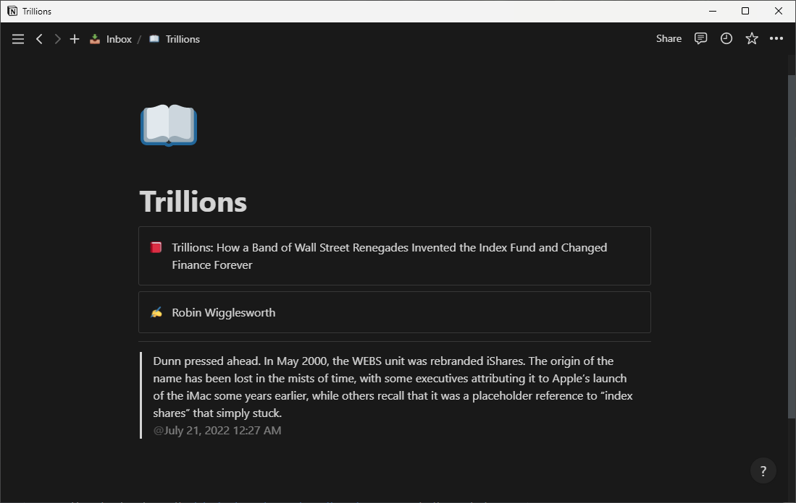

# Kindle Clippings to Notion

Small Rust program to parse Kindle clips and upload them to Notion.



## Env variables

```ini
NOTION_API_KEY=...
NOTION_PAGE_ID=...
# Optional:
CLIPPINGS_LOCATION="documents/My Clippings.txt"
```

## Usage

- Create a Notion API "Internal integration" at <https://www.notion.so/my-integrations> with read, update, and insert content capabilities
- Give it access to the page you want to use as parent to your clippings pages
- Download and save the [latest release binary from the releases page](https://github.com/mrtolkien/kindle_to_notion/releases) to the root of your Kindle
- Create a `.env` file at the root of your Kindle with the same structure as [this example `.env` file](https://github.com/mrtolkien/kindle_to_notion/blob/main/.env.example)
  - `NOTION_API_KEY` is the API key for your integration
  - `NOTION_PAGE_ID` is the page ID of the page where you want to insert your clippings pages
    - You can get it by checking the page link from the web app or the `Share` menu on Desktop
  - Optional:
    - `CLIPPINGS_LOCATION` is the location of the `My Clippings.txt` file relative to the program
- Run the executable from the root of your Kindle and see it populate

## Behaviour and limitations

- For each book which has clippings, a new page gets created inside the page with id `NOTION_PAGE_ID`
- If the book name contains the `:` character, only the text before it is used for the page title
  - The full book name is put in a callout at the beginning of the page
- The book author gets his own callout block
- Inside the page each clip is its own [quote block](https://www.notion.so/help/writing-and-editing-basics#types-of-content), finished with an inline date referencing the capture day
- Each quote gets tagged with the clipping date/time, using the machine's local timezone
- `==========` gets appended to the file to mark where the parsing ended

- There can only be 100 blocks in a Notion page so this program won't work if you have over 100 quotes for a book

### Database

A database page can be used as the root. Each group of quotes will therefore be a database row.

## Next steps

If you want to give a shot, here are some example features that would be welcome additions:

- Support for database properties
- Support for updating existing quote pages
- Support for different usage paradigms, for example 1 quote per page for databases
